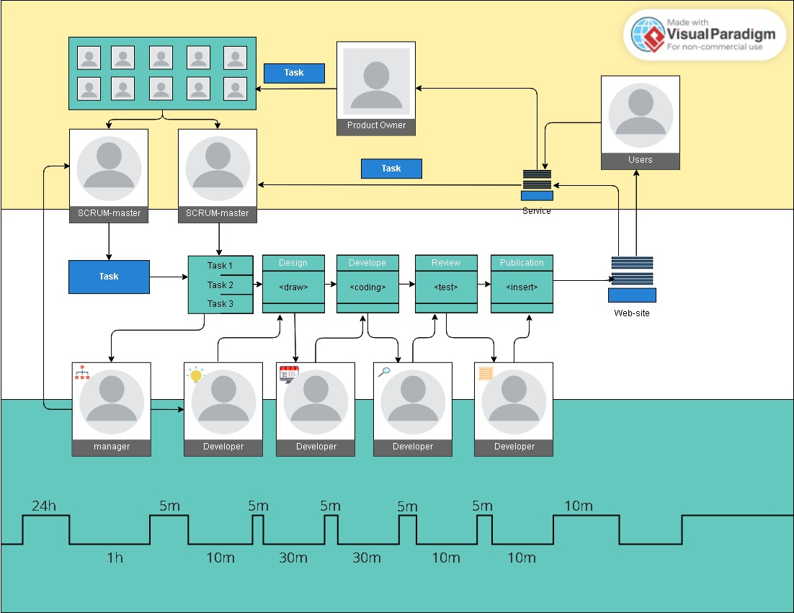
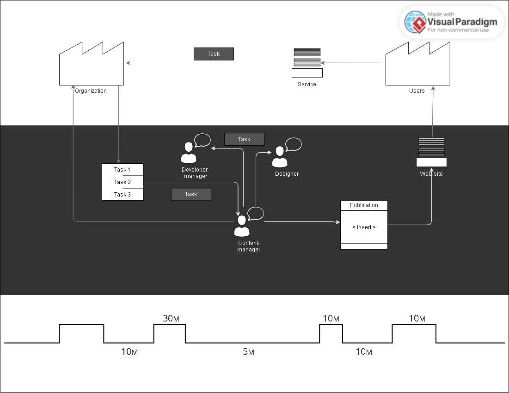

# ЗАДАЧА

Проанализируйте свою личную повседневную работу в компании или работу одного из отделов в вашей компании на предмет наличия потерь.

1. Нарисуйте VSM-карту.
2. Найдите потери и классифицируйте их в соответствии с изученным на лекции материалом.
3. Подумайте, как можно исключить эти потери, и нарисуйте новую VSM-карту в соответствии с вашими предложениями.

Для выполнения домашнего задания вы можете использовать все рекомендованные на семинаре программы для рисования VSM-карты. В качестве выполненного домашнего задания необходимо приложить скрин или pdf-файл с VSM-картой и ответом на поставленные в задании вопросы.

# РЕШЕНИЕ

Компания является исполнителем по контракту разработки и поддерки веб-сайта Product-owner ООО "Ромашка". На регулярных совещаниях заказчика в лице руководителя с заместителями, начальниками подразделений и отделом по связям с общественностью проводятся обсуждения законодательства, деятельности организации, нововведений и проблем. Информация доводится до ответственных сотрудников, отвечающих каждый за свой раздел на веб-сайте, с целью поддержания информации в актуальном состоянии.

В случае неактуальности информации ответственные сотрудники направляют, необходимые в корректировке данные и изменения, в отдел, взаимодействующий с компанией-исполнителем по контракту - SCRUM-master. Перед отправкой корректировки визируются у начальника и заместителя руководителя.

В компании-исполнителя ведется бэклог заявок и их распределение менеджером между сотрудниками (дизайнер, разработчик, редактор, контент-менеджером). Чаще всего заявка требует вовлечения всех этих специалистов. В случае неточностей в заявке, менеджер пытается уточнить или вовзращает заявку на доработку. Например, формат публикации не соответствует требованиям сайта.

Заявки могут иметь как срочный вид исполнения, так и временной интервал, в редких случаях точную дату в будущем.

Среднее время выполнения заявки составляет 3 часа, а в случае уточнений до 24 часов.

При таком подходе высок риск потерь излишней транспортировки, недостаточной информации, недостаточной коммуникации и недостаточной качества решения. Менеджер может неточно понять поставленную задачу, неверно ее передать дизайнеру или разработчику, неточно проводить тестирование, неточно оптимизировать код.

Также высок риск перепроизводства когда дополнительная разработка не требуется и достаточно внести небольшие исправления в существующие элементы дизайна, кода или теста. Вдруг новый вид ценности не устроит заказчика и тогда процесс придется корректировать и выполнять заново. Произвольные способы выполнения работ из-за недостаточной стандартизации.

Разработчик, дизайнер или тестировщик в этом случае может выполнять больше чем требуется, постоянно переключаться с одной задачи на другую. Потери на перемещениях и движениях персонала ведут к потерям времени и ресурсов.

В случае уточнения заявок менеджер должен отслеживать их корректировку. Их может скопиться много и могут возникнуть потери на обслуживание запасов, а также потери от простоев.

## Новая модель

Вместо этого предлагается формализовать форму заявки, внеся туда пункты, которые чаще всего требуют уточнения (точное место размещения информации, срок публикации, наименование подателя заявки с номером телефона, поле для разъяснений). 

Также предлагается автоматизировать процесс публикации, разработав стандартные элементы дизайна, которые чаще всего требуются для верстки страницы. В административную панель добавить редактор с дефолтными установками шрифта, размеров, доступа к изображениям. Создать классы документов для различных рубрик, такие как Видео, Карточка подразделения, Персона, Услуга.

Предлагается делигировать обязаностями менеджера контент-менеджеру, который будет привлекать дизайнера и разработчика только в случае острой необходимости.

При таком подходе большинство рисков сведены к минимуму, а среднее время выполнения заявки составляет 1,15 часа.

