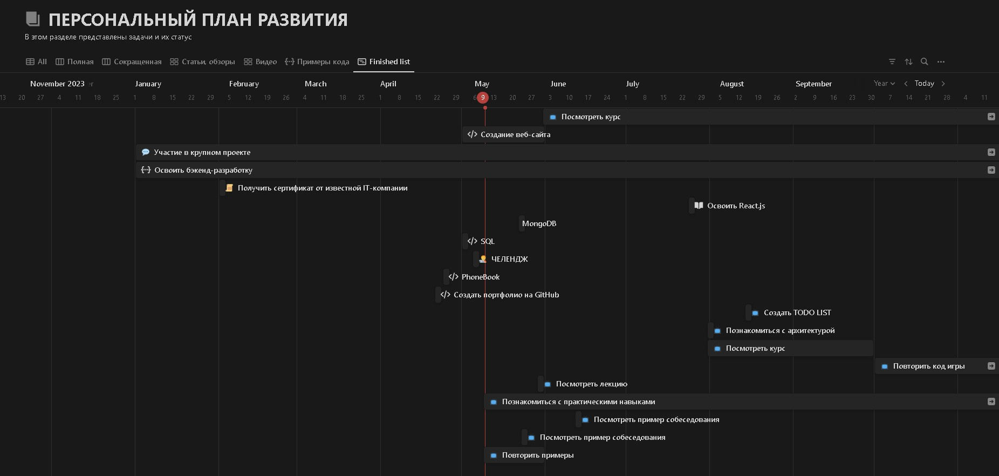

# ЗДАЧА

Проанализируйте свой процесс обучения в ИТ-сфере и продвижение по карьере в этом направлении. 
Выделите задачи, которые стоят перед Вами на месяц/квартал/год. 
Ранжируйте поставленные задачи по классам обслуживания – выберите цвета для Kanban-карточек. 
Определите WiP для управления потоком незавершённых задач. 
Отразите определённые Вами задачи на личной Kanban-доске.

## РЕШЕНИЕ

Месяц:
1. Изучение основ JavaScript — Стандартный класс, зелёная карточка;
2. Создать TODO LIST на JavaScript — Стандартный класс, зелёная карточка;
3. Окончание проекта по созданию веб-сайта с использованием HTML/CSS — Стандартный класс, зелёная карточка;
4. Активное участие в сообществе разработчиков — Быстрый класс, синяя карточка;
5. Изучить примеры и рекомендации по прохождению собеседований — Быстрый класс, синяя карточка;
6. Повторить примеры Java — Стандартный класс, зелёная карточка;
7. Повторить Массивы и foreach в Java — Быстрый класс, синяя карточка;
8. Познакомиться с архитектурой — Стандартный класс, зелёная карточка;
9. Выполнить задание по созданию PhoneBook на Python  — Быстрый класс, синяя карточка;
10. Выполнить задание по MySQL — Стандартный класс, зелёная карточка;
11. Изучить материал по СУБД MongoDB — Стандартный класс, зелёная карточка.

Квартал:
1. Освоить React.js — Стандартный класс, зелёная карточка;
2. Изучение баз данных (SQL и MongoDB) —  Стандартный класс, зелёная карточка;
3. Участие в хакатонах и курсах для улучшения навыков —  Быстрый класс, синяя карточка;
4. Создание портфолио проектов —  Стандартный класс, зелёная карточка;
5. Повторить курс по Java —  Стандартный класс, зелёная карточка;
6. Повторить код любого проекта на языке Java —  Стандартный класс, зелёная карточка.

Год:
1. Получить сертификат от известной IT-компании —  Стандартный класс, зелёная карточка;
2. Освоить бэкенд-разработку (Node.js, Express.js) — Стандартный класс, зелёная карточка;
3. Участие в крупном проекте — Быстрый класс, синяя карточка;
4. Повторить курс по Java — Стандартный класс, зелёная карточка;
5. Познакомиться с практическими навыками разработчика на языке Java — Стандартный класс, зелёная карточка;
6. Создать портфолио на GitHub — Стандартный класс, зелёная карточка.

Определение WiP (Work in Progress):

Мои ограничения WiP зависят от класса задачи:
1. Задачи быстрого класса (синяя карточка) — не более 1 в работе, чтобы избежать рассеивания внимания.
2. Задачи стандартного класса (зелёная карточка) — не более 3 в работе, чтобы поддерживать продуктивность на оптимальном уровне.

## NOTION

В качестве Kanban доски используется редактор Notion.

Создана обыкновенная data base "Персональный план развития" со списком всех задач. На практике специалисты рекомендуют создавать одну базу данных для всего проекта.

Задачи содержат поля:
* Заголовок (текстовое поле);
* Подзаголовок (текстовое поле);
* Тип (селектор с выбором темы);
* Статус (селектор с выбором этапа, на котором находится задача: "В планах", "Выполнить", "В процессе", "Тест", "Готово", "Архив");
* Оценка (селектор с выбором оценки для задач, которые оценивает соответствующий автор задачи);
* Автор (текстовое поле). Автором задачи может быть преподаватель на курсе, руководитель проекта, от которых требуется обратная связь, а также авторы курсов, где оценка не требуется;
* Период (выбр даты планируемого начала и окончания задачи);
* Сссылка для указания гиперссылок на проекты, конспекты, другие материалы;
* Прогресс для обозначения текущего состояния задачи;
* Кнопка Button для удобства завершения задачи, при нажатии на которую задача автоматически перемещается на этап "Готово";
* Длительность (селектор с выбором длительности задачи "месяц, квартал, год").

Доска разделена на 2 типа: полная и сокращенная. Это делает доску удобной для чтения и работы с задачами. Полный и соркащенный типы повзоляют отображать только те элементы задач, которые требуются для оперативного чтения пользователем, а также классы задач: "Стандартный" и "Быстрый". Эти классы ограничений WiP позволяют ограничивать процесс работы на задачах, которые необходимо выполнить в текщем периоде.

Рабочая область также разделена по типу контента для более удобного поиска нужного типа: "Текстовые материалы", "Видео", "Примеры кода", а также "Календарь".

